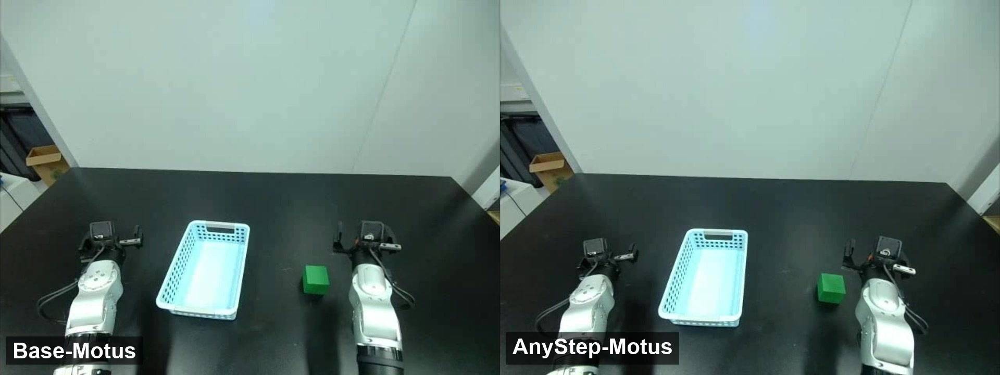

# AnyStep-WAM

### Budget-Aligned Distillation and Adaptive Inference for World Action Models

**CVMI & IAL** · [Paper](https://arxiv.org/abs/2609.33748) · [Real-world videos](#real-world-demonstrations)

> **Code and model weights: coming soon.**
>
> This repository currently provides the paper overview and real-world demonstrations. Training and inference code, together with model weights, will be released here.

## Overview

World-action models (WAMs) couple predictive visual modeling with action generation, typically using a fixed number of denoising steps. However, manipulation tasks contain action chunks with varying sensitivity to generation errors: critical actions require precision, while less sensitive actions allow faster generation with fewer denoising steps.

**AnyStep-WAM** supports **tunable-budget prediction** and **scene-dependent computation allocation**. Budget-aligned teacher-trajectory distillation trains a single model for one-step prediction through multi-step refinement. A lightweight risk-benefit scheduler uses a single preview to predict scene difficulty and budget-specific student–teacher fidelity, then selects the smallest budget predicted to meet the risk-adaptive fidelity requirements. Preview recycling reuses that computation within the selected denoising trajectory.


We evaluate AnyStep on **Motus, FastWAM, and LingBotVA**, across **50 RoboTwin 2.0 tasks** and **six real-world manipulation tasks**. Adaptive inference reduces denoising steps and latency while maintaining comparable or higher average task success rates.

## Real-world demonstrations

Experiments use a **Unitree G1D dual-arm robot**. All videos are shown at their original **1× speed**. Click the comparison thumbnail or a task link to open its video on GitHub.

### Base-Motus vs. AnyStep-Motus

[](media/base-motus-anystep-motus-comparison.mp4)

[Watch the side-by-side comparison](media/base-motus-anystep-motus-comparison.mp4) · Put Block · 1× speed

### Six tasks across three backbones

The following recordings use AnyStep adaptive inference.

| Task | AnyStep-FastWAM | AnyStep-LingBotVA | AnyStep-Motus |
| --- | --- | --- | --- |
| Bowl Pouring | [Video](media/fastwam-bowl_pouring.mp4) | [Video](media/lingbotva-bowl_pouring.mp4) | [Video](media/motus-bowl_pouring.mp4) |
| Clean Table | [Video](media/fastwam-clean_table.mp4) | [Video](media/lingbotva-clean_table.mp4) | [Video](media/motus-clean_table.mp4) |
| Put Block | [Video](media/fastwam-put_block.mp4) | [Video](media/lingbotva-put_block.mp4) | [Video](media/motus-put_block.mp4) |
| Put Cup | [Video](media/fastwam-put_cup.mp4) | [Video](media/lingbotva-put_cup.mp4) | [Video](media/motus-put_cup.mp4) |
| Stack Blocks | [Video](media/fastwam-stack_blocks.mp4) | [Video](media/lingbotva-stack_blocks.mp4) | [Video](media/motus-stack_blocks.mp4) |
| Stack Bowls | [Video](media/fastwam-stack_bowls.mp4) | [Video](media/lingbotva-stack_bowls.mp4) | [Video](media/motus-stack_bowls.mp4) |

## Release status

- [x] Paper and method overview
- [x] Real-world demonstration videos
- [ ] Training and inference code — coming soon
- [ ] Model weights — coming soon

## Citation

```bibtex
@article{wang2026anystepwam,
  title   = {AnyStep-WAM: Budget-Aligned Distillation and Adaptive
             Inference for World Action Models},
  author  = {Wang, Rui and Wang, Xiangyu and Yang, Donglin and Li, Yibo
             and Chen, Canyang and Wang, Zhongrui and Qi, Xiaojuan},
  journal = {arXiv preprint arXiv:2609.33748},
  year    = {2026},
  url     = {https://arxiv.org/abs/2609.33748}
}
```
